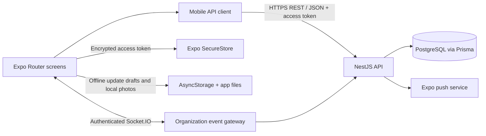

<p align="center">
  
</p>

<h1 align="center">FlowNexa Mobile</h1>

<p align="center"><strong>Plan. Execute. Prove.</strong><br/>A mobile companion for teams to check assigned work, report progress, capture evidence drafts, and stay current while away from their desk.</p>

<p align="center">
  <a href="https://github.com/haroondhanyal/FLOWNEXA/actions/workflows/ci.yml"></a>
  
  
</p>

## Mobile product overview

FlowNexa Mobile is the iOS/Android companion to the FlowNexa team workspace. It focuses on quick, in-context actions: see today's workload, browse assigned tasks, submit progress, comment, record time, capture a local evidence photo draft, sync offline work updates, and read workspace notifications.

The mobile client uses the same organization, task, work update, notification, and review records as the web client. It does not carry its own database or create a second copy of workspace data. The API remains the source of truth; local storage is used for the access token and drafts that have not synced yet.

The web dashboard and shared backend are in the [`web-app` branch](https://github.com/haroondhanyal/FLOWNEXA/tree/web-app). This branch is the mobile development track. The repository is a monorepo, so `web-app/api/` and `web-app/database/` are included here because the mobile app depends on that shared backend.

## Mobile architecture



### Runtime flow

1. The login screen sends credentials to the shared API and stores the returned short-lived access token in Expo SecureStore.
2. Screens call the shared NestJS API through `mobile-app/lib/api.ts`. The API validates the token, organization membership, role, and DTO before returning or changing tenant data.
3. The home, task, inbox, and create screens load the signed-in user's first organization. The API is authoritative; opening a tab or receiving a workspace event refreshes saved data.
4. If a work update cannot reach the API because the network is unavailable, the teammate can save a local draft and explicitly sync it after reconnecting. Server validation failures stay visible instead of being silently queued.
5. Camera captures remain in the app's document directory and are shown as local evidence drafts. They are not uploaded because a private binary evidence endpoint/storage service is not configured.
6. Push registration is opt-in. The app registers an Expo device token against the signed-in user and removes it at logout; push requires an EAS project and a development build.

## Mobile screen map

| Screen | What it is for | Source |
| --- | --- | --- |
| Sign in | Authenticate, restore an existing local session, and enter the workspace. | `mobile-app/app/index.tsx` |
| Home | Show open tasks, due-today count, completed work, and blocked/review items. | `mobile-app/app/(tabs)/index.tsx` |
| Tasks | Browse tasks assigned to the current user and their status/project/due date. | `mobile-app/app/(tabs)/tasks.tsx` |
| Create | Submit task updates, save/sync offline drafts, capture local photos, comment, record manual time, or create a task. | `mobile-app/app/(tabs)/create.tsx` |
| Inbox | Read stored organization notifications and mark them as read. | `mobile-app/app/(tabs)/inbox.tsx` |
| Profile | Opt into Expo push notifications, remove the device token, and sign out. | `mobile-app/app/(tabs)/profile.tsx` |

## Repository layout on this branch

```text
.
├── .github/workflows/ci.yml    # Web/API CI plus mobile checks on this branch
├── README.md                   # Mobile branch and full product overview
├── mobile-app/
│   ├── app/                    # Expo Router login and tab screens
│   ├── lib/api.ts              # API client, session refresh, SecureStore
│   └── lib/useWorkspaceEvents.ts
├── web-app/api/                # Shared NestJS backend used by both clients
└── web-app/database/prisma/    # Shared PostgreSQL schema and migrations
```

## Run the mobile app

### Requirements

- Node.js 22.13 or newer and npm
- Expo Go for ordinary development; use an EAS development build for push notifications
- A running FlowNexa API (see [the API setup below](#start-the-shared-api))
- A phone/simulator that can reach the API host

```bash
cd mobile-app
npm ci
cp .env.example .env
```

Set `EXPO_PUBLIC_API_URL` in `.env` to the API URL reachable from the device. For a physical phone, use your development computer's LAN IP, for example `http://192.168.1.25:4000/api/v1`; `localhost` points to the phone itself. Then run:

```bash
npm start
```

Choose a platform in the Expo CLI, or run `npm run ios` / `npm run android` when the corresponding simulator/toolchain is installed.

### Start the shared API

```bash
cd web-app
cp .env.example .env
docker compose up postgres redis
```

In another terminal:

```bash
cd web-app/api
npm ci
npm run prisma:generate
npm run prisma:migrate
npm run prisma:seed
npm run dev
```

The API base URL is `http://localhost:4000/api/v1` from the development computer. Configure AI provider keys only in the API `.env`; do not put secrets in Expo's `EXPO_PUBLIC_` variables.

## Configuration

`mobile-app/.env.example` contains:

| Variable | Purpose |
| --- | --- |
| `EXPO_PUBLIC_API_URL` | REST API base URL. Must be reachable by the device. |
| `EXPO_PUBLIC_EAS_PROJECT_ID` | EAS project used to request an Expo push token. Optional until push is configured. |

Do not store private keys, database credentials, JWT secrets, or AI provider keys in this app. Values prefixed by `EXPO_PUBLIC_` are bundled into the client and are public.

## Mobile verification

```bash
cd mobile-app
npm ci
npx expo install --check
npm run typecheck
```

The repo workflow also checks web/API type, lint, test, schema, and build jobs on pushes, and runs the mobile SDK/package and TypeScript checks on the `mobile-app` branch.

## Current mobile scope

- Camera photos are local-only drafts until the server gets authenticated private upload and storage.
- Offline queue support is for work-update drafts; comments, task creation, time entries, and inbox actions need a live API connection.
- Push delivery currently covers review events and needs EAS/device credentials plus platform permission.
- Sign-in currently loads the first organization returned by the API; an organization switcher and mobile workspace setup are follow-ups.
- The mobile app uses React Native components and does not reuse the web DOM or CSS. Both clients share API contracts and the data model instead.

## Contributing on `mobile-app`

1. Pull the latest `mobile-app` branch before starting a mobile change.
2. Keep screens in `mobile-app/app/` and reusable transport/session logic in `mobile-app/lib/`.
3. Route workspace reads/writes through `lib/api.ts`; do not create a parallel client database.
4. Keep server authorization and validation in the shared API. A hidden button is not an access-control rule.
5. Run Expo package validation and TypeScript checks before pushing.
6. Coordinate shared API/Prisma changes with the web/API team and carry them through the `web-app` integration branch.

See [web team tasks](docs/WEB-TEAM-TASKS.md) for the broader product ownership plan. See the [web branch](https://github.com/haroondhanyal/FLOWNEXA/tree/web-app) for desktop workspace screens and API development.
