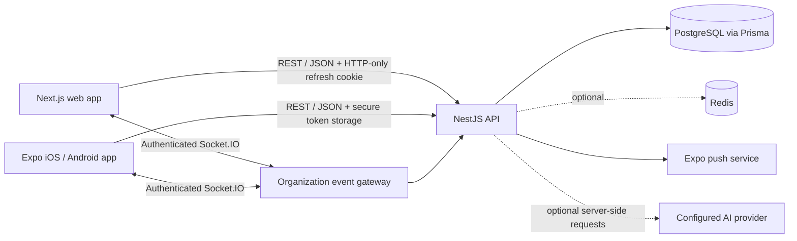

<p align="center">
  
</p>

<h1 align="center">Plan. Execute. Prove.</h1>

<p align="center">A shared work-management workspace for teams to plan projects, coordinate tasks, report progress, review outcomes, and keep an accountable record of work.</p>

<p align="center">
  <a href="https://github.com/haroondhanyal/FLOWNEXA/actions/workflows/ci.yml"></a>
  
  
</p>

## Product overview

FlowNexa brings a team's planned work and proof of progress into one workspace. People organize work by organization, project, and task; teammates can add progress updates, evidence links, comments, and time records; managers can review submissions and inspect the audit history. The web dashboard gives teams a broad view, while the Expo mobile app focuses on assigned tasks, updates, and notifications.

The product is designed around a simple work loop:

1. **Plan** — set up an organization, projects, priorities, owners, and due dates.
2. **Execute** — work from task lists, boards, and a daily view; add comments and time.
3. **Prove** — post progress, link supporting evidence, request review, and preserve decisions in the audit history.

The repository is a monorepo: the web client, shared API/database, and mobile client live in separate folders. Both branch tracks contain the shared API required by their client. `web-app` is the intended default branch; `mobile-app` is the dedicated mobile development branch.

## Architecture



### Main layers

| Layer | Location | Responsibility |
| --- | --- | --- |
| Web client | `web-app/src/` | Next.js App Router, sign-in/onboarding, dashboard shell, independent workspace screens, shared API client, and realtime client. |
| Mobile client | `mobile-app/` | Expo Router sign-in and tabs for home, assigned tasks, create/update, inbox, and profile; secure token storage and local update drafts. |
| REST API | `web-app/api/src/` | NestJS controllers/DTOs/services for auth, organizations, projects, tasks, work updates, reviews, reports, AI, and notifications. |
| Data | `web-app/database/prisma/` | PostgreSQL schema, migrations, indexes, and Prisma client generation. Organization IDs scope tenant data. |
| Realtime | `web-app/api/src/events/`, `web-app/src/components/RealtimeBridge.tsx`, `mobile-app/lib/useWorkspaceEvents.ts` | Authenticated Socket.IO events. The API verifies organization membership before a client joins its event room. |
| Local services | `web-app/docker-compose.yml` | PostgreSQL, Redis, API, and web containers for local development. |
| Quality checks | `.github/workflows/ci.yml` | Web/API checks and mobile checks on the mobile branch. |

### Request and data flow

1. A person signs in through the selected client. The API issues short-lived access credentials and an HTTP-only refresh cookie for the web flow; the mobile client keeps its access token in SecureStore.
2. The client loads organizations and sends an organization ID with workspace requests. API services verify membership and apply role checks to writes.
3. NestJS validates request DTOs, runs domain logic, and reads/writes PostgreSQL through Prisma. Important task activity, review actions, and decisions create audit records.
4. Successful changes publish organization-scoped Socket.IO events. Connected members refresh the relevant screen; stored inbox notifications remain available after reconnect.
5. Optional AI requests are made by the API using bounded workspace context. The AI key remains on the server; plans and task breakdowns are suggestions and do not create records.

## Repository layout

```text
.
├── .github/workflows/ci.yml
├── docs/WEB-TEAM-TASKS.md
├── mobile-app/                  # Expo client
└── web-app/
    ├── src/                     # Next.js app and workspace screens
    ├── api/src/                 # NestJS REST, auth, events, AI, services
    ├── database/prisma/         # PostgreSQL schema and migrations
    ├── Dockerfile
    ├── api/Dockerfile
    └── docker-compose.yml
```

## Branch model

| Branch | Purpose | Expected GitHub setting |
| --- | --- | --- |
| `web-app` | Default integration branch; primary workstream for the web client and shared API. | Default branch |
| `mobile-app` | Mobile workstream for the Expo client and mobile-specific improvements. | Regular branch, based on the shared project |

Both branches use the same repository and monorepo folder layout. Keep shared API/schema changes coordinated across the two branches, and merge them through `web-app` when ready. Feature branches for the six web workstreams should start from the latest `web-app`; see [the team task board](docs/WEB-TEAM-TASKS.md).

## Run locally

### Requirements

- Node.js 22.13 or newer
- npm
- Docker Desktop / Docker Engine for the local PostgreSQL and Redis services
- Expo Go for basic device development; push notifications require an EAS project and a development build

### Web and API

```bash
cd web-app
cp .env.example .env
docker compose up postgres redis
```

In a second terminal, run the API:

```bash
cd web-app/api
npm ci
npm run prisma:generate
npm run prisma:migrate
npm run prisma:seed
npm run dev
```

In another terminal, run the web client:

```bash
cd web-app
npm ci
npm run dev
```

Open <http://localhost:3000>. The API is at <http://localhost:4000/api/v1>; Swagger is at <http://localhost:4000/api/v1/docs>. `NEXT_PUBLIC_API_URL` defaults to the local API URL.

For the complete local container stack, copy `web-app/.env.example` to `web-app/.env`, replace both JWT secrets with separate random values of at least 32 characters, then run `docker compose up --build` from `web-app/`.

### Mobile

Start the API using the steps above. Then:

```bash
cd mobile-app
cp .env.example .env
# Set EXPO_PUBLIC_API_URL to an API host reachable from the phone.
npm ci
npm start
```

For a physical device, use the development computer's LAN address instead of `localhost`. Camera captures are currently held on-device; private server-side binary evidence storage is not configured yet.

## Feature overview

### Web workspace

- Sign in/register, session refresh, expiring one-time email verification/password reset, workspace setup, projects, team management/invites, custom roles, and task assignment/status changes.
- Overview, day/week/month calendar, reports with CSV export, search, notification inbox/read/archive, audit history, and review decisions.
- Task activity: progress, next action/blocker, URL and private file evidence with image previews, threaded comments, manual time and a start/stop timer.
- Shared workspace notes with author-aware edit/delete controls, rich text, headings, lists, links, colors/highlights, tables, inline images, and a sandboxed preview.
- Multi-workspace switcher grouped by organization, workspace-specific project/task/team views, and owner/admin controls to create workspaces or edit their name and logo.
- Profile and account settings for name, phone, PNG/JPEG profile photo, workspace role visibility, password changes, plus browser-saved light/dark/warm themes, accent colors, and background textures.
- AI assistant: workspace questions, weekly summaries, daily plan suggestions, and task breakdown suggestions.

### Mobile workspace

- Sign-in, organization overview, assigned task browsing, work updates, manual time, inbox, and profile.
- SecureStore access token, authenticated realtime refresh, local work-update drafts, camera capture drafts, and Expo push registration.

### API and data controls

- Organization membership checks on tenant-scoped endpoints and event-room joins.
- Owner/Admin/Member/Viewer roles, DTO validation, Helmet, CORS configuration, and global request throttling.
- Review actions and task activity audit history; in-app notification records and Expo push delivery for review events.
- PostgreSQL/Prisma migrations include notification archive state, the single-active-timer constraint, and hashed one-time account tokens.

## Development checks

```bash
# Web
cd web-app && npm run typecheck && npm run lint && npm run build

# API (run from web-app/api)
npm run prisma:generate
npm run typecheck
npm test -- --coverage
npm run lint
npm run build
```

CI runs Prisma validation/client generation plus the API test/lint/build checks, the web typecheck/lint/build checks, and mobile typechecking for changes to the `mobile-app` branch.

## Current scope and follow-ups

This is an active product foundation, not a claim that every enterprise production feature is finished. Current known follow-ups include:

- Custom organization roles now enforce permissions across task/project/team changes, invitations, reviews, evidence, reports, and audit access. Invitation listing, resend (with token rotation), and revoke are available. Password reset and email verification flows use hashed, expiring, single-use tokens; configure `RESEND_API_KEY`, a verified `EMAIL_FROM`, and `WEB_APP_URL` in the API environment. Set `REQUIRE_EMAIL_VERIFICATION=true` to gate new registrations and sign-ins on verification.
- Organization member directory, team creation, team membership management, and invitation lifecycle controls are implemented. Broader member administration remains future work.
- Private API-served evidence uploads (PNG/JPEG/PDF/UTF-8 text, 10 MB limit) use randomized filenames, content-signature checks, permission-gated downloads, and a persistent Docker volume. S3-compatible object storage/signing and file malware scanning remain production deployment work; mobile camera images are still local drafts.
- Per-event notification preferences, resilient queued/retry push delivery, and broader browser end-to-end coverage. Profile photos are currently stored as small data URLs in the user record; move them to private object storage for production-scale accounts.
- Hosted production secrets/database, deployment configuration, monitoring, backups, and operational runbooks.

Keep API keys and production secrets out of client bundles and Git. Configure `AI_API_KEY` and `AI_MODEL` only in the API environment when enabling AI. Email delivery uses the Resend API from the server only.

## Product identity

**FlowNexa — Plan. Execute. Prove.** The shared brand mark is based on a four-part flow symbol and the violet workspace palette. Web uses the SVG asset at `web-app/public/flownexa-logo.svg`; the mobile sign-in screen renders the same mark and wordmark in native views.
