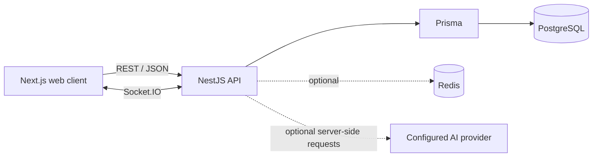
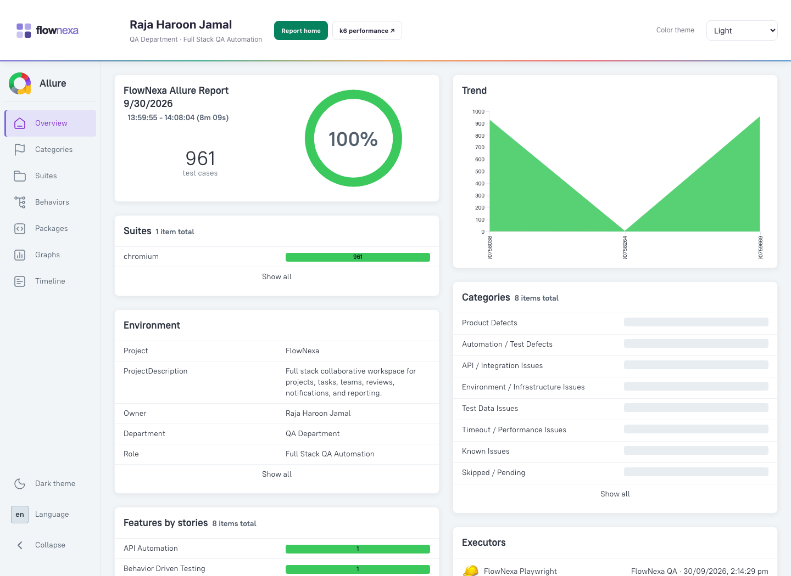
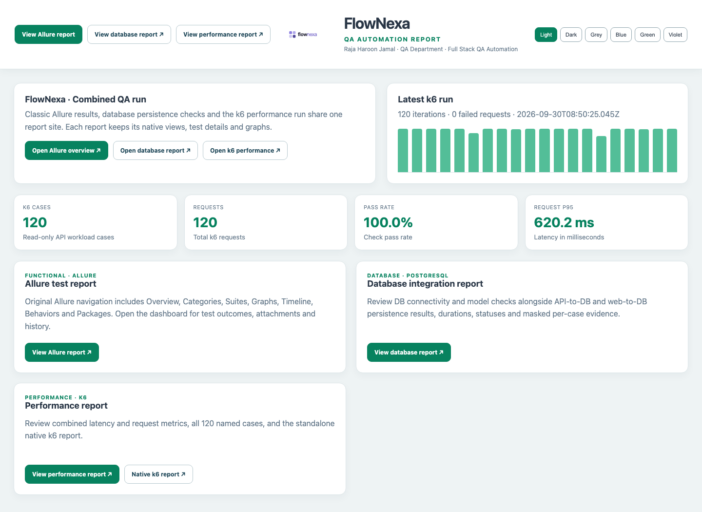
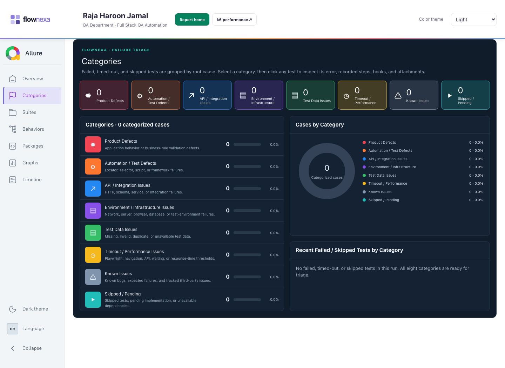
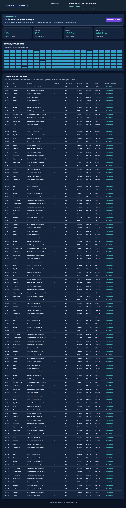
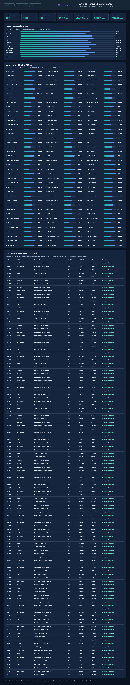
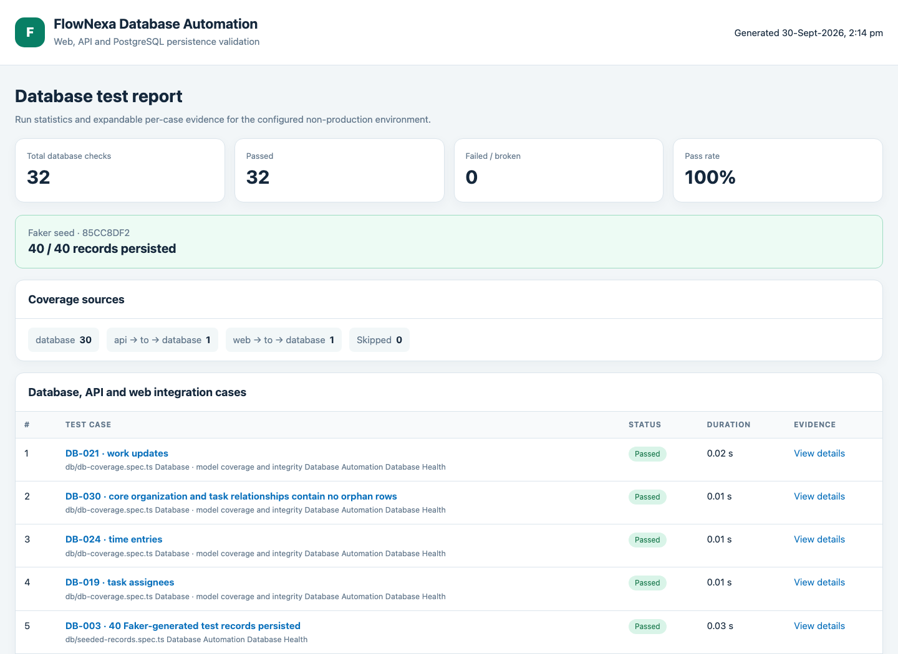

# FlowNexa Web Application

FlowNexa is a collaborative workspace for planning projects, coordinating tasks, sharing progress, and reviewing completed work. This folder contains the Next.js web client, the NestJS API, the Prisma/PostgreSQL schema, local Docker services, and the web automation project.

For repository-wide architecture and mobile development, see the [root README](../README.md). For the automation implementation and test conventions, see [automation/README.md](automation/README.md).

## Contents

- [Web application](#web-application)
- [Architecture](#architecture)
- [Run the web app and API](#run-the-web-app-and-api)
- [Web automation](#web-automation)
- [Test suites and coverage](#test-suites-and-coverage)
- [Allure report](#allure-report)
- [Failure categories](#failure-categories)
- [k6 performance reports](#k6-performance-reports)
- [Database automation and reports](#database-automation-and-reports)
- [Common workflows](#common-workflows)
- [Troubleshooting](#troubleshooting)

## Web application

The web client supports organization workspaces, projects and tasks, team membership, invitations and roles, task progress and evidence, threaded comments, time entries, review decisions, notifications, reports, search, and audit history. The Overview screen summarizes Plan, Execute, and Prove work stages. The AI assistant can answer questions about workspace data and produce suggested plans or task breakdowns; generated suggestions do not create records automatically.

The client is built with Next.js App Router and React. The API is NestJS. Prisma maps PostgreSQL data and Redis supports optional API services. Local service definitions live in [`docker-compose.yml`](docker-compose.yml).

## Architecture



```text
web-app/
├── src/                    Next.js pages, screens, components and browser client
├── api/src/                NestJS controllers, services, DTOs and events
├── database/prisma/        PostgreSQL schema, migrations and seed data
├── automation/             Playwright suites, Allure and k6 report tooling
├── docs/automation/assets/ Screenshots embedded in this guide
├── public/                 FlowNexa logo and static assets
└── docker-compose.yml      PostgreSQL, Redis, API and web services
```

## Run the web app and API

Requirements: Node.js 22.13+, npm, and Docker Desktop or Docker Engine.

1. Configure local environment values and start the stack:

   ```bash
   cd web-app
   cp .env.example .env
   # Replace both JWT secrets with separate random values (32+ characters).
   docker compose up --build
   ```

2. Open the web app at <http://localhost:3000>. The API is at <http://localhost:4000/api/v1>; Swagger is at <http://localhost:4000/api/v1/docs>.

The compose stack exposes PostgreSQL on host port `55319` by default and Redis on `6379`. To run the API/web outside Docker, follow the root README's [local development steps](../README.md#run-locally).

Keep `.env` values private. Use a dedicated local or QA database and account for automation. Do not point mutation tests, Faker seeding, or the 120-user k6 workload at production.

## Web automation

The automation project is inside this web app; it extends the existing Playwright setup and uses its fixtures, page objects, locators, browser configuration, API configuration, and Allure reporter.

```text
automation/
├── config/                 URL/browser settings and Allure categories
├── data/                   Screen inventory and test inputs
├── fixtures/               Auth/session, browser capture and DB fixtures
├── locators/               Shared screen and web selectors
├── pages/                  Existing page objects
├── tests/
│   ├── api/                API authorization contracts
│   ├── ui/                 Screen, responsive, form and interaction tests
│   ├── bdd/                Given/When/Then workspace journeys
│   ├── smoke/              Fast workspace readiness checks
│   ├── regression/         Workspace shell and screen invariants
│   ├── negative/            Invalid inputs and auth edge cases
│   ├── db/                  PostgreSQL model and integrity checks
│   ├── integration/         API-to-DB and web-to-DB persistence checks
│   └── k6/                  Named read-only performance workloads
├── scripts/                Run, seed, categorize and build reports
└── reporter/               Combined report home and performance pages
```

### Configure an automation run

```bash
cd web-app/automation
cp .env.example .env
npm ci
npx playwright install chromium
```

Set `WEB_BASE_URL`, `API_BASE_URL`, and a dedicated `TEST_EMAIL` / `TEST_PASSWORD`. For authenticated DB and k6 checks, provide `TEST_ORGANIZATION_ID` where needed. DB checks read `DATABASE_URL` from `automation/.env`, falling back to `web-app/.env`. `PW_START_WEB_SERVER=true` asks Playwright to start the local Next.js server on port `3100`; it does not start the API or PostgreSQL. With the default `false`, point `WEB_BASE_URL` at an already-running web app (the Compose port is `3000`).

The shared Playwright fixture captures screenshots and videos for test cases and traces for failures. Named browser actions and hooks are attached as Allure steps. API and database tests run through the same Playwright reporter; DB cases use the backend fixture so they do not launch Chromium.

## Test suites and coverage

`npm test` runs every Playwright test discovered by `config/playwright.config.ts`, including the DB and integration folders, then builds the linked report site. The last documented complete run had **961 passed, 0 failed, 0 skipped**:

| Area | Cases in that run | Scope |
| --- | ---: | --- |
| API contracts | 190 | Authorization and protected-route request variants |
| UI | 279 | Responsive screen checks, AI assistant and focused page flows |
| BDD journeys | 150 | Data-driven workspace scenarios |
| Smoke | 120 | Workspace readiness checks |
| Regression | 120 | Stable navigation and screen invariants |
| Negative | 70 | Invalid input and authentication behavior |
| Database | 30 | PostgreSQL connectivity, model queryability, seed persistence and integrity |
| API/web to database | 2 | API and UI task persistence and audit verification |
| **Total** | **961** | Counts are run-specific; new tests change the next total. |

The database coverage checks are named `DB-001` through `DB-030`. DB-to-API and DB-to-web integration cases are separate `INT-DB-*` cases so the Categories and Suites views retain clear grouping.

## Allure report

The project generates an Allure 2 report and preserves its standard navigation: Overview, Categories, Suites, Graphs, Timeline, Behaviors, and Packages. The customized FlowNexa header includes the logo, owner/team information, theme selection, and links to the combined and performance reports. Allure also retains executor metadata, screenshots, videos, failure traces, test steps, and trend history.

The Overview shows the actual number of results present in the run; the last full run displayed **961**. Results are never hard-coded into the overview. Regenerate Allure after a run with `npm run report:allure`.



### Combined report home

The report home links the Allure dashboard, DB report, combined performance report, and standalone native k6 report. It also displays the latest k6 run statistics when a k6 summary exists.



## Failure categories

The Categories page groups eligible results by root cause and leaves all configured categories visible when their count is zero. The current definitions in [`automation/config/allure/categories.json`](automation/config/allure/categories.json) are:

| Category | Example signals |
| --- | --- |
| Product Defects | Assertion or expected/actual mismatch, business-rule or functional behavior failure |
| Automation / Test Defects | Missing locator/element, strict-mode or selector issue, detached node, test/framework error |
| API / Integration Issues | HTTP 4xx/5xx, schema mismatch, API or service integration failure |
| Environment / Infrastructure Issues | Connection/network/server/database/browser/environment unavailable |
| Test Data Issues | Missing, invalid, duplicate, or unavailable required data |
| Timeout / Performance Issues | Playwright/navigation/API/wait timeout or a slow-response threshold failure |
| Known Issues | Known bug, expected failure, or tracked third-party issue |
| Skipped / Pending | Skipped tests, pending implementation, and unavailable dependencies |

Allure's configured `matchedStatuses`, `messageRegex`, and `traceRegex` are copied into `allure-results/categories.json` before report generation. The generated-report postprocessor also classifies skipped/unknown results explicitly, because Allure's native category tree can omit those statuses. That keeps even one skipped database case visible under **Skipped / Pending**. Failed/broken timeout errors are placed under **Timeout / Performance Issues**. Clicking a category expands its cases; clicking a case opens the result's failure detail, steps, hooks, and attachments.

The postprocessor uses JavaScript regular expressions for the extra skipped/timeout display mapping; the configured patterns are kept in syntax that is compatible with the Allure rules and that postprocessor. Put specific category rules before broader ones. When adding a category, update both `categories.json` and the matching label/color in `scripts/customize-allure-report.mjs`, then rebuild the report.



The screenshot is from a clean run with no failures or skips, so all category counts are zero. The category panels remain present and populate automatically when a matching result occurs.

## k6 performance reports

The k6 suite defines **120 named, authenticated, read-only API workloads**. The run uses up to 120 virtual users and checks HTTP success, response-time thresholds, request throughput, and latency percentiles. Requests do not create or update application data. The runner uses an installed Grafana k6 CLI when available, otherwise it invokes the official `grafana/k6` Docker image.



The screenshot shows the populated report from the documented run: 120 cases and requests, 100% checks passed, and a 620.2 ms overall P95. It includes the complete per-case table, with expandable request and response metadata. Authorization values are redacted.



The native k6 screenshot includes the full page and all 120 cases. k6 summary artifacts do not retain response bodies; inspect the corresponding API test in Allure for captured API evidence.

## Database automation and reports

The 30 DB cases use the generated Prisma client from `database/prisma/schema.prisma`. They check PostgreSQL connectivity, seeded Faker-record persistence, queryability for all 25 Prisma models, primary keys, and organization/project/task references. Two separate integration cases exercise API→DB and web→DB task persistence and audit data. Mutating integration checks are opt-in and clean up only the exact task they create.

To enable those mutations, configure a dedicated non-production database and set:

```dotenv
DB_ENVIRONMENT=local
DB_MUTATION_TESTS=true
```

Use `qa`, `test`, `dev`, or `development` for an approved isolated test environment. A production label is rejected. Seed 40 Faker task records only when you want persistent sample data for inspection; the seed command verifies the inserted and persisted counts, marks every row with a unique `FNQA_FAKER_40_<run>` title prefix, and intentionally leaves those records in the test database.



The DB report lists per-case status, duration, expected/actual evidence, source coverage, and sanitized errors. Its 40-record seed summary is read from `automation/artifacts/db/faker-seed.json`. The Allure result retains the structured database evidence attachment too.

## Common workflows

From `web-app/automation/`:

```bash
npm run test:list          # discover the current test count
npm test                   # all Playwright API/UI/BDD/DB/integration suites + linked reports
npm run test:api            # API contracts only
npm run test:ui             # UI suite only
npm run test:db:all         # DB and API/web-to-DB cases
npm run seed:db:40          # create and verify 40 tagged test tasks
npm run report:k6           # run 120 k6 workloads and regenerate linked reports
npm run report:allure       # rebuild the report from existing allure-results
npm run report:db           # rebuild the detailed database report
npm run report:open         # open the generated Allure report locally
```

`npm test` clears stale results before starting a fresh full run, preserves previous report history, and rebuilds the report even if the test run fails. To keep the result files while running a focused command, set `PW_PRESERVE_ALLURE_RESULTS=true`; omit it for an independent clean run.

Generated result directories and authentication state are excluded by `automation/.gitignore`. Keep the source test, configuration, helper, report-template, and documentation files under version control; publish generated reports as CI artifacts when desired.

## Troubleshooting

| Symptom | Check |
| --- | --- |
| Browser tests cannot open the app | Confirm the web server is running, then align `WEB_BASE_URL` with port `3000` (Compose) or `3100` (`PW_START_WEB_SERVER=true`). |
| Authenticated tests skip or fail | Check dedicated `TEST_EMAIL`, `TEST_PASSWORD`, API URL, and organization/workspace membership. |
| DB tests cannot connect | Confirm PostgreSQL is healthy and `DATABASE_URL` uses host port `55319` for the default Compose mapping. |
| API/UI→DB cases skip | Set `DB_MUTATION_TESTS=true` and a non-production `DB_ENVIRONMENT`; confirm the user has a project in the test organization. |
| k6 runner cannot authenticate | Run Playwright global setup first, or supply `TEST_ORGANIZATION_ID` and `K6_ACCESS_TOKEN`. |
| A report still shows only a focused run | Run `npm test` to build a complete run report; focused Playwright commands clean previous results unless `PW_PRESERVE_ALLURE_RESULTS=true`. |
| Java cannot be found by Allure | Install Java 8+ and ensure Java is on `PATH`; the report builder removes stale `JAVA_HOME` overrides. |
